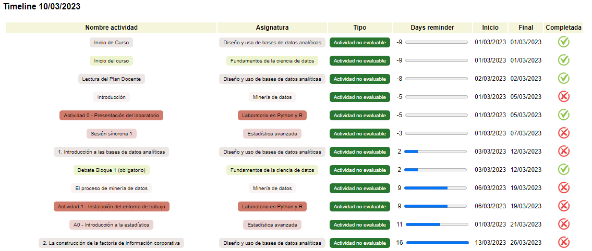

#  &nbsp;Timeline UOC
 




## <div align="left">What is this library for?</div>
<hr />
Library <code>uoc.py</code> is used for get timeline in all classrooms.<br />When you call the <code>get_timeline_html()</code> method the following files are generated automatically:<br />
<ul>
<li>timeline.html </li>
<li>timeline.csv (for use in another programs like Notion)</li>
<li>timeline.ical (for use in Calendars)</li>
</ul>

Also get messages and show toast notifications (tested on Windows 10).


## <div align="left">Installation and execution</div>
<hr />
<ol>
<li >
<strong>Download code & configure toml file</strong>
<ul>
<li><strong>UOC credentials</strong> (username & password)</li>
<li>Configure your <strong>chromedriver path</strong>.<br />
<code><small>Download your specific chromedriver version <a href="https://chromedriver.chromium.org/downloads" target="_blank">here</a></small></smal></code> 
</li>
<li>Information about your classrooms (classroomID, name, color and subjectId).<br />
<code><small>You can found this information (classroomId and subjectId) in the url when you open a classroom in new window. </small></code>
</li>
</ul>
</li>
<li >
<strong>Creation of the virtual environment</strong>

```console
py -m venv timeline-env  
```
</li>
<li><strong>Activate virtual environment</strong><br /><br />
On Windows, run:<br />

```console
.\timeline-env\Scripts\activate.bat
```

On Unix or MacOS, run::<br />

```console
source timeline-env/bin/activate
```
</li>
<li><strong>Install libraries</strong>

```console
pip install -r requirements.txt
```

</li>
<li><strong>Program execution</strong><br />
A simple program (<code>main.py</code>) is used to load the library and execute the necessary code to be able to generate the files and see the message notifications.

```console
py main.py
```

You're free to modify this program to get, for example, messages in a loop. Enjoy! ;)
</li>